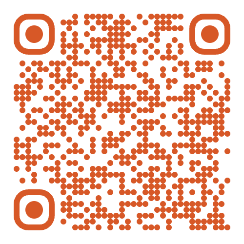
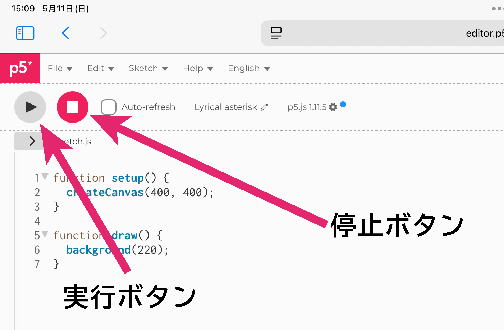

# 情報・工学探究
## 第1回 メディアプログラミング授業資料
**見て，感じて，描いてみよう**

授業担当：情報学部 情報学科 情報メディ専攻 清水 哲也

---

<div align=center>



</div>

---

# 本日の授業内容

- 授業導入・自己紹介，「メディアとは何か？」
- p5.jsの概要と描画の基本
- 例題：抽象アートを作ろう

※適当なタイミングで10分間の休憩を入れます

---

# 「メディア」ってなんだろう？

-	メディア＝情報を伝える手段（例：新聞、映像、音楽）
-	デジタル時代のメディア：視覚・音・動き・インタラクション
-	プログラミングでメディアを自分で作る体験をしよう！

---

# 本日使用するツール

- ブラウザ
- https://editor.p5js.org/

---

# p5.jsとは？

-	JavaScriptベースのビジュアルプログラミングライブラリ
- Webブラウザで動く
-	図形，色，動き，インタラクションを簡単に実装
-	教育，アート，Webで広く利用されている
- p5 = [Processing](https://processing.org/) , js = [JavaScript](https://developer.mozilla.org/ja/docs/Web/js)

---

# 特徴と利点

- ブラウザ上で使える（アプリ不要）
- アカウントなしでも利用可能（保存は不可）
- p5.jsライブラリに特化した設計
- iPadでも動作（Chrome / Safari）

---

# アクセス方法

- SafariまたはChromeを開く
- アドレスバーに入力：https://editor.p5js.org/
- Enterでアクセス

---

# 画面構成

- **左側**：コードを書くエリア
- **右側**：描画結果が表示されるプレビューエリア
- **上部**：ファイル操作ボタン、実行ボタン、設定

---

<!-- _class: no-footer --> 

<div align=center>


</div>

---

# 実行と停止

- **再生ボタン**を押すとプログラムが実行
- **停止ボタン**で描画を止めることが可能

---

<div align=center>



</div>

---

# 基本の構成

-	`setup()`：最初に1回実行
-	`draw()`：毎フレーム実行される

```js
function setup() {
  createCanvas(400, 400);
}

function draw() {
  background(220);
  ellipse(200, 200, 100, 100);
}
```

---

# よく使う図形

- [`rect()`](https://p5js.org/reference/p5/rect/)：長方形（正方形）を描画
  - `rect(左上のX座標, 左上のY座標, 横, 縦)`
- [`ellipse()`](https://p5js.org/reference/p5/ellipse/)：楕円（円）を描画
  - `ellipse(中心のX座標, 中心のY座標, 横, 縦)`
- [`line()`](https://p5js.org/reference/p5/line/)：線を描画
  - `line(始点のX座標, 始点のY座標, 終点のX座標, 終点のY座標)`

```js
rect(50, 50, 100, 100);
ellipse(200, 200, 100, 50);
line(0, 0, 300, 300);
```

---

# 色をつける

- [`fill()`](https://p5js.org/reference/p5/fill/)：図形などの中を塗りつぶす色
- [`stroke()`](https://p5js.org/reference/p5/stroke/)：枠線など線の色
- [`background()`](https://p5js.org/reference/p5/background/)：背景色
- 色の指定方法
  - `fill(gray)`：値が1つの場合グレースケール（値：`0`〜`255`）
  - `fill(Red, Green, Blue)`：値が3つの場合フルカラー（値：`0`〜`255`）

```js
fill(255, 0, 0);
stroke(0);
background(240);
```

---

# マウス（タッチ）に反応する

-	`mouseX`, `mouseY`でマウス（タッチ）の位置を取得

```js
function setup() {
  // 変更なし
}

function draw() {
  background(255);
  ellipse(mouseX, mouseY, 50, 50);
}
```

---

# クリック（タッチ）で図形を追加

- マウスを持っているひとは`mousePressed()`
- マウスを持っていないひとは`touchStarted()`

```js
function setup() {
  createCanvas(400, 400);
  background(255);
}

function mousePressed() {
  fill(random(255), random(255), random(255));
  ellipse(mouseX, mouseY, 30, 30);
}
```

---

# ランダムに円を描画

```js
function setup() {
  // 変更なし
}
function draw() {
  fill(random(255), random(255), random(255));
  ellipse(random(width), random(height), 20, 20);
}
```

---

# 例題：抽象アートを作ろう

- [`random()`](https://p5js.org/reference/p5/random/)：ランダムな数を生成
  - `random()`：`0`〜`1`までの乱数（実数）を生成
  - `random(5)`：`0`〜`5`までの乱数（実数）を生成
  - `random(10, 100)`：`10`〜`100`までの乱数（実数）を生成
- [`touchStarted()`](https://p5js.org/reference/p5.Element/touchStarted/)：タッチで追加（マウスのひとは`mousePressed()`を利用）
- [`noStroke()`](https://p5js.org/reference/p5/noStroke/)：枠線を描画しない
- [`fill()`](https://p5js.org/reference/p5/fill/), [`background()`](https://p5js.org/reference/p5/background/) を工夫

---

# サンプルコード1：カラフルな円

- ランダムな位置にカラフルな円を描画
- `fill(r, g, b, a)`：4つ目の値は透明度`a = 0〜255`

```js
function setup() {
  createCanvas(400, 400);
  background(255);
  noStroke();
}
function draw() {
  fill(random(255), random(255), random(255), 100);
  ellipse(random(width), random(height), 30, 30);
}
```

---

# サンプルコード2：マウス（タッチ）で描く

- [`mouseDragged()`](https://p5js.org/reference/p5/mouseDragged/)：マウスボタンが押されている間のみ動く関数

```js
function setup() {
  createCanvas(400, 400);
  background(255);
}

function mouseDragged() {
  fill(random(255));
  ellipse(mouseX, mouseY, 10, 10);
}
```

---

# サンプルコード3：画面をタップで反応

- [`displayWidth`](https://p5js.org/reference/p5/displayWidth/),[`diplayHeight`](https://p5js.org/reference/p5/displayHeight/)：Preview画面の幅と高さ

```js
function setup() {
  createCanvas(displayWidth, displayHeight);
  background(255);
  noStroke();
}

function touchStarted() {
  fill(random(255), random(255), random(255));
  rect(mouseX, mouseY, 50, 50);
}
```

---


# 参考リンク
- [p5.js公式サイト](https://p5js.org/)
- [p5.js日本語公式サイト](https://p5js.jp/) ※少し情報が古いかも
- [p5.jsリファレンス](https://p5js.org/reference/)
- [p5.js 初めの一歩 Creative Coding p5.js – HIM.CO ヒム・カンパニー](https://himco.jp/2019/03/12/2%EF%BC%9Ap5-js-%E5%88%9D%E3%82%81%E3%81%AE%E4%B8%80%E6%AD%A9-creative-coding-javascript/)
- [文系大学生のためのp5.js入門](https://zenn.dev/ojk/books/intro-to-p5js)


---

<div align=center>

# 【付録】使用した関数まとめ

</div>

---

# 基本構成

```js
function setup() {
  createCanvas(400, 400);
}
function draw() {
  background(255);
}
```

---

# 色・背景・線

```js
fill(r, g, b);
stroke(r, g, b);
background(gray);
noStroke();
```

---

# 図形

```js
rect(x, y, w, h);
ellipse(x, y, w, h);
line(x1, y1, x2, y2);
```

---

# マウス操作

```js
mouseX, mouseY
mousePressed()
mouseDragged()
```

---

# ランダム

```js
random(255);
random(width);
```

---

# アルファ（透明度）

```js
fill(r, g, b, alpha);
```

---

# テキスト

```js
text("Hello", x, y);
textSize(24);
```